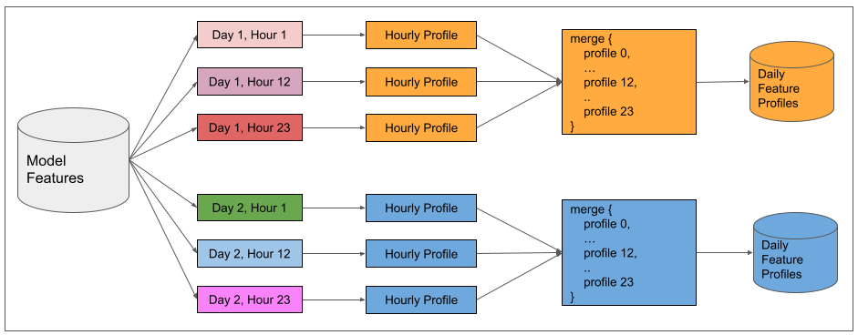
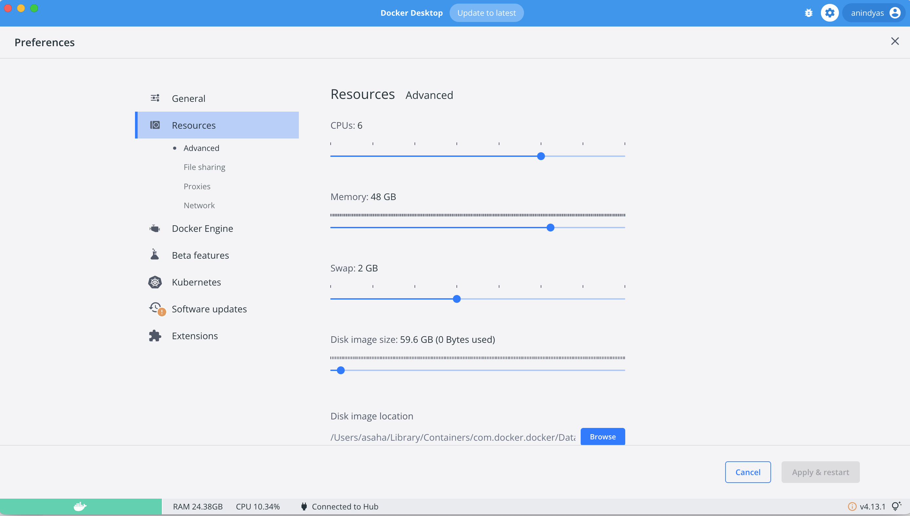

# Building a large scale unsupervised model anomaly detection system

Welcome to the Anomaly Detection Demo!


**Prerequisites:** Docker Desktop or Docker daemon running on your machine.


## Using the pre-built docker container
We have provided a docker image that you can run on your local machine and follow along the notebooks with the instructor.

The data files needed are also loaded into the docker image.

```
export DOCKER_DEFAULT_PLATFORM=linux/amd64

docker run -it --rm -p 8888:8888 anindyas/pydata-seattle:2.1
```

Using `--env GRANT_SUDO=yes --user root` will spawn the jupyter notebook with jovyan having root privileges.

Due to the usage of the flag `--rm` Docker automatically cleans up the container and removes the file system 
when the container exits.

